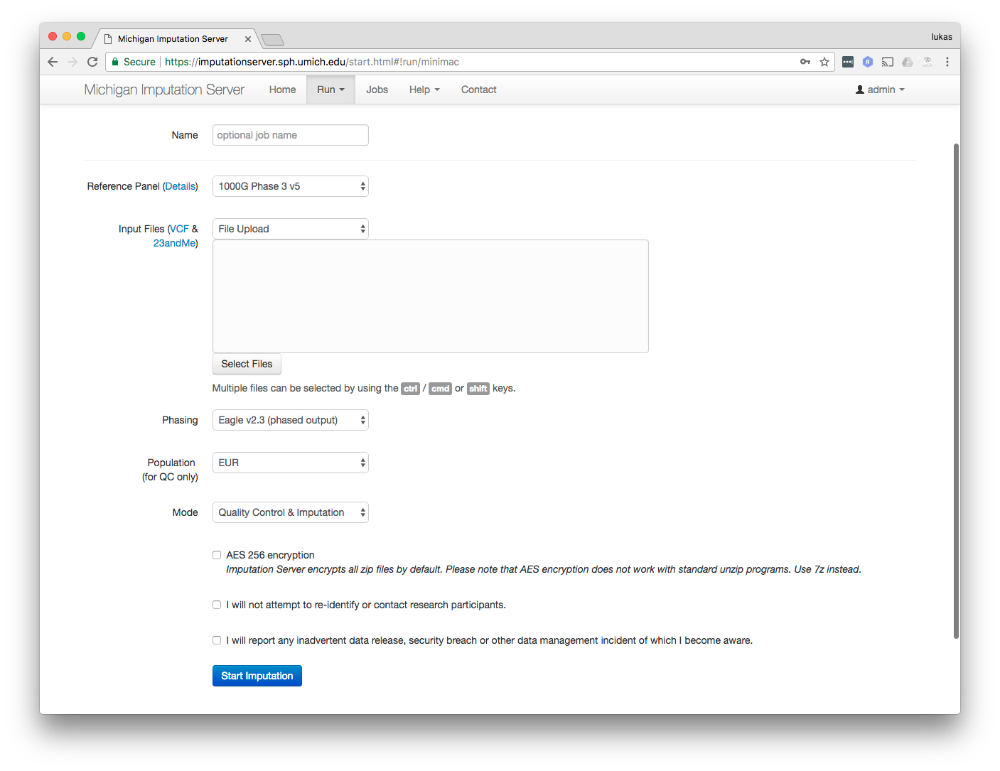
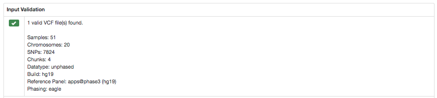
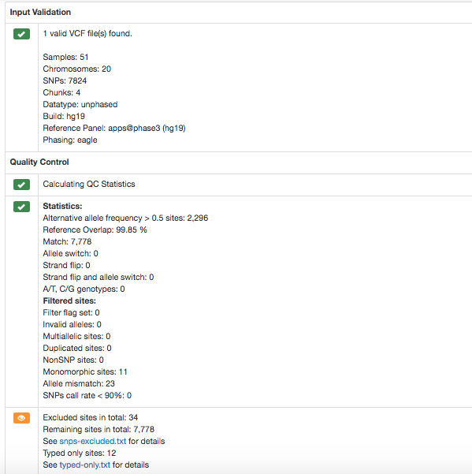
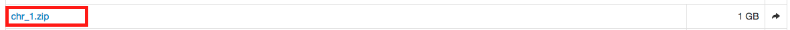
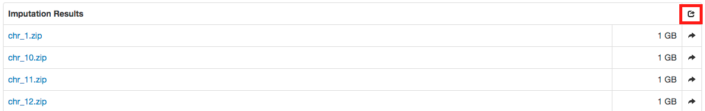
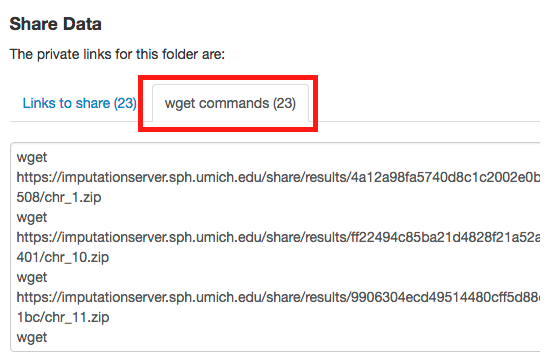

# Michigan Imputation Server

A step by step tutorial for the TOPMed Workshop (April 30 - May 1 2018, Ann Arbor).

## Contact

[Sebastian Schoenherr](mailto:sebastian.schoenherr@i-med.ac.at) and [Lukas Forer](mailto:lukas.forer@i-med.ac.at)

## Warm up

1. Please [register](https://imputationserver.sph.umich.edu/index.html#!pages/register) an user account
2. An activation link is sent to the provided email address
3. Please verify your account using the activation link
4. Download the following sample data:
  - [chr20.unphased.vcf.gz](https://imputationserver.sph.umich.edu/static/downloads/test-data/chr20.unphased.vcf.gz)

## Login

1. Please [login](https://imputationserver.sph.umich.edu/index.html#!pages/login) with your credentials
2. Click on the **Run** tab to start a new job
3. The following submission dialog appears:

## Start your first job

1. Select as a reference panel **1000 Genomes Phase 3 (Version 5)**
2. Click on **Select Files** and upload the sample file [chr20.unphased.vcf.gz](https://imputationserver.sph.umich.edu/static/downloads/test-data/chr20.unphased.vcf.gz)
3. Accept our terms and conditions
4. Click on **Submit Job** to start your imputation

## Quality control

In a first step we check if your uploaded GWAS data are valid and calculate some basics statistics such as number of samples, chromosomes and SNPs.

In this step we check each variant and exclude it in case of:

1. contains invalid alleles
2. duplicates
3. indels
4. monomorphic sites
5. allele mismatch between reference panel and uploaded data
6. SNP call rate < 90%

All filtered variants are listed in a file called `statistics.txt` which can be downloaded by clicking on the provided link.

## Download a single file

1. If imputation has finsihed, we compress and encrypt your data and send you a one time password via email.

2. A zip archive including the results can be downloaded directly from the server by clicking on the filenames in the **Results** tab.

   

## Download all results at once

1. To download all files of a folder (for example folder **Imputation Results**) you can click on the **share** symbol of the folder:

   

2. A new dialog appears which provides you all private links at once. Click on the tab  **wget commands** to get copy & paste ready commands that can be used on Linux or MacOS to download all files:

   

## Get access to TOPMed reference panel

Write an email to cfuchsb@umich.edu to get access to the TOPMed panel.
