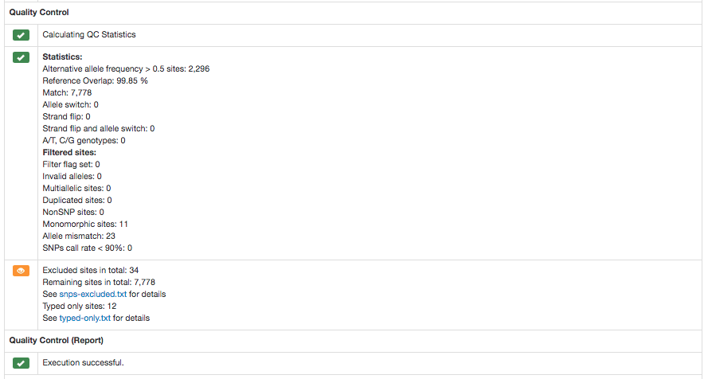

# Michigan Imputation Server

A step by step tutorial for the TOPMed Workshop (April 30 - May 1 2018, Ann Arbor).

## Contact

[Sebastian Schoenherr](mailto:sebastian.schoenherr@i-med.ac.at) and [Lukas Forer](mailto:lukas.forer@i-med.ac.at)

## Warm up

1. Please [register](https://imputationserver.sph.umich.edu/index.html#!pages/register) a new user account
2. Verify your account using the activation link (sent by email)

## Login

1. Please [login](https://imputationserver.sph.umich.edu/index.html#!pages/login)
2. Click on the **Run** tab to start a new job (**Note:** Select the new Minimac4 Workflow!)
3. The following submission dialog appears:

## Start your first job

1. Select as a reference panel **1000 Genomes Phase 3 (Version 5)**
2. Click on **Select Files** and upload the sample data [chr20.unphased.vcf.gz](https://imputationserver.sph.umich.edu/static/downloads/test-data/chr20.unphased.vcf.gz)
3. Accept the terms and conditions
4. Click on **Submit Job** to start your imputation

## Quality control

In an initial step we check if your uploaded GWAS data are valid and calculate some basics statistics such as number of samples, chromosomes and SNPs.

Several checks are now executed. Please have a look at the [pipeline details](http://imputationserver.readthedocs.io/en/latest/pipeline/) for further details. For example, a variant is excluded in case of:

1. contains invalid alleles
2. duplicate
3. indel
4. monomorphic site
5. allele mismatch between reference panel and uploaded data
6. SNP call rate < 90%

All filtered variants are listed in a file called `statistics.txt` which can be downloaded by clicking on the provided link.

## Download a single file

1. If the imputation was succesful, we compress and encrypt the data and send you a one-time password via email.

2. A zip archive including the results (info, dosage file) can be downloaded directly from the server by clicking on the filename in the **Results** tab.

   

## Download all results at once

1. To download all files (e.g. **Imputation Results**) click on the **share** symbol of the folder:

   

2. A new dialog appears which provides you all private links at once. Click on the tab  **wget commands** to get copy & paste ready commands. These commands can be used on Linux or MacOS to download the files:

   

## Get access to the TOPMed reference panel

Write an email to [Christian](mailto:cfuchsb@umich.edu).
